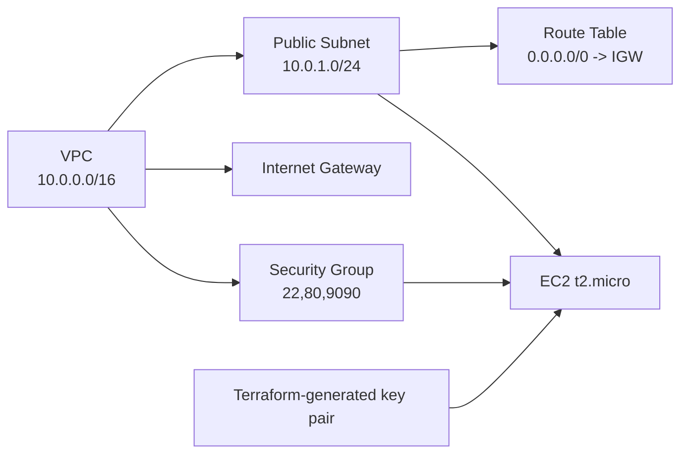

# Terraform AWS Infrastructure on AWS

Provision a complete, minimal AWS environment with Terraform modules and deploy an application to EC2 using Jenkins.

## Table of contents

- [Architecture](#architecture)
- [What gets created](#what-gets-created)
- [Project structure](#project-structure)
- [Prerequisites](#prerequisites)
- [Backend and provider configuration](#backend-and-provider-configuration)
- [Quick start (local Terraform)](#quick-start-local-terraform)
- [Module reference](#module-reference)
- [Jenkins CI/CD guide](#jenkins-cicd-guide)
- [Security notes](#security-notes)
- [Recommended .gitignore](#recommended-gitignore)
- [Troubleshooting](#troubleshooting)

## Architecture



## What gets created

| Component | Details |
|---|---|
| VPC | `10.0.0.0/16` |
| Public Subnet | `10.0.1.0/24` in `us-west-2a` |
| Internet Gateway | Attached to the VPC |
| Route Table | Default route `0.0.0.0/0` to IGW |
| Route Association | Route table associated to public subnet |
| Security Group | Inbound `22`, `80`, `9090`; outbound all |
| Key Pair | `my-ec2-key` + local PEM file |
| EC2 Instance | Ubuntu AMI `ami-075686beab831bb7f`, type `t2.micro` |

## Project structure

```text
terraform/
  backend.tf
  provider.tf
  main.tf
  outputs.tf
  Jenkinsfile
  modules/
    vpc/
    subnet/
    igw/
    route-table/
    security-group/
    keypair/
    ec2/
```

## Prerequisites

- Terraform `>= 1.3` (recommended)
- AWS account with permissions for VPC, EC2, Route Tables, Security Groups, Key Pairs, S3, and DynamoDB
- AWS credentials available locally (for local runs) or in Jenkins credentials store (for CI)
- Existing remote state resources in `us-west-2`:
  - S3 bucket: `remote-backend`
  - DynamoDB table: `terraform-locks`

## Backend and provider configuration

Current config from this repo:

- Region: `us-west-2`
- Backend bucket: `remote-backend`
- State key: `envs/dev/terraform.tfstate`
- Lock table: `terraform-locks`
- Encryption: `true`

## Quick start (local Terraform)

Run from the repository root (`terraform/`):

```bash
terraform init
terraform fmt -recursive
terraform validate
terraform plan -out=tfplan.binary
terraform apply tfplan.binary
```

Get EC2 public IP:

```bash
terraform output -raw instance_ip
```

Destroy when done:

```bash
terraform destroy
```

## Module reference

| Module | Purpose | Inputs | Outputs |
|---|---|---|---|
| `modules/vpc` | Creates VPC | None | `vpc_id` |
| `modules/subnet` | Creates subnet | `vpc_id` | `subnet_id` |
| `modules/igw` | Creates internet gateway | `vpc_id` | `igw_id` |
| `modules/route-table` | Route table + association | `vpc_id`, `igw_id`, `subnet_id` | None |
| `modules/security-group` | Security group rules | `vpc_id` | `sg_id` |
| `modules/keypair` | Generates key pair + PEM | None | `key_name`, `private_key_path` |
| `modules/ec2` | Creates EC2 instance | `subnet_id`, `sg_id`, `key_name` | `instance_ip` |

Top-level Terraform output:

- `instance_ip`: EC2 public IP

## Jenkins CI/CD guide

### 1. Jenkins prerequisites

- Jenkins agent/node with:
  - `terraform` installed and available in `PATH`
  - `ssh`, `git`, and basic Linux tools
  - Optional: `tflint`, `tfsec`
- Recommended Jenkins plugins:
  - Pipeline
  - Credentials Binding
  - ANSI Color
  - Timestamper
  - Git

### 2. Required Jenkins credentials

The pipeline expects these credential IDs in Jenkins:

- `aws-access-key`
- `github-pat-token-id`

Important:

- Verify the AWS credential mapping in `Jenkinsfile` to ensure `AWS_ACCESS_KEY_ID` and `AWS_SECRET_ACCESS_KEY` are sourced correctly for your credential type.
- If your Jenkins credential IDs differ, update the IDs in `Jenkinsfile`.

### 3. Create the pipeline job

1. Create a Pipeline or Multibranch Pipeline job in Jenkins.
2. Point SCM to this repository.
3. Use `Jenkinsfile` at repo root as pipeline script.
4. Save and run build.

### 4. What the Jenkins pipeline does

1. Checkout source
2. `terraform fmt -check -recursive`
3. `terraform init` and `terraform validate`
4. Optional lint/security checks (`tflint`, `tfsec`)
5. `terraform plan -out=tfplan.binary`
6. Archive plan as `tfplan.txt`
7. Pause for manual approval
8. `terraform apply -auto-approve tfplan.binary`
9. Read `instance_ip` output
10. SSH to EC2 using generated PEM and deploy app

### 5. Run and verify deployment

After successful build:

1. Open build artifacts and inspect `tfplan.txt`.
2. Approve manual gate when ready.
3. Confirm pipeline logs show fetched `INSTANCE_IP`.
4. Validate app on `http://<INSTANCE_IP>:9090`.

### 6. Jenkins operational tips

- Keep `my-ec2-key.pem` out of source control.
- Restrict who can approve the manual apply stage.
- Consider splitting deploy and infrastructure apply into separate jobs for production.

## Security notes

- Inbound `22`, `80`, and `9090` are open to `0.0.0.0/0`; restrict to trusted CIDRs for real environments.
- PEM file generated at `modules/keypair/my-ec2-key.pem` is sensitive.
- Use least-privilege IAM policies for Terraform/Jenkins.
- Rotate AWS and GitHub credentials regularly.

## Recommended .gitignore

```gitignore
.terraform/
*.tfstate
*.tfstate.*
*.tfplan
tfplan.binary
modules/keypair/*.pem
crash.log
```

## Troubleshooting

### Terraform init fails (backend)

- Confirm S3 bucket `remote-backend` exists in `us-west-2`.
- Confirm DynamoDB lock table `terraform-locks` exists and is accessible.

### SSH to EC2 fails

- Confirm inbound port `22` is allowed from your source IP.
- Confirm PEM file permissions are `0400`.
- Confirm instance is in running state and has a public IP.

### App not reachable on port `9090`

- Confirm security group allows inbound `9090`.
- Confirm Java process is running on EC2.
- Check app logs generated by deployment script (`app.log`).
